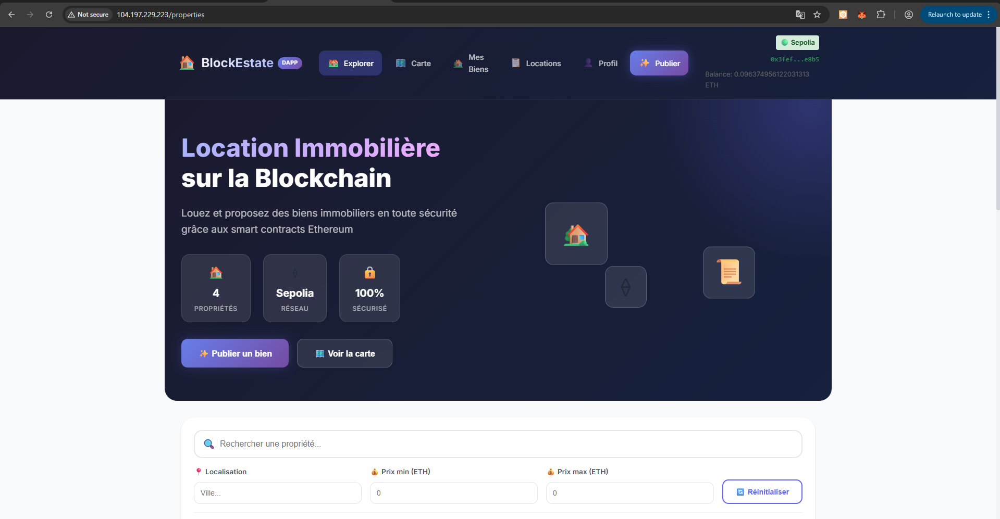
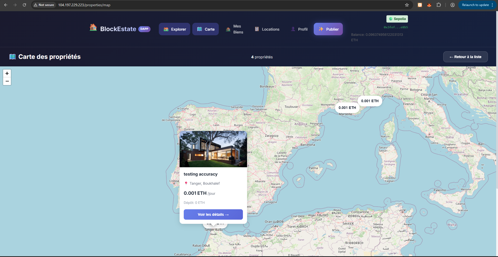
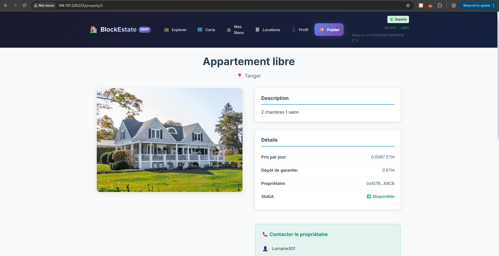
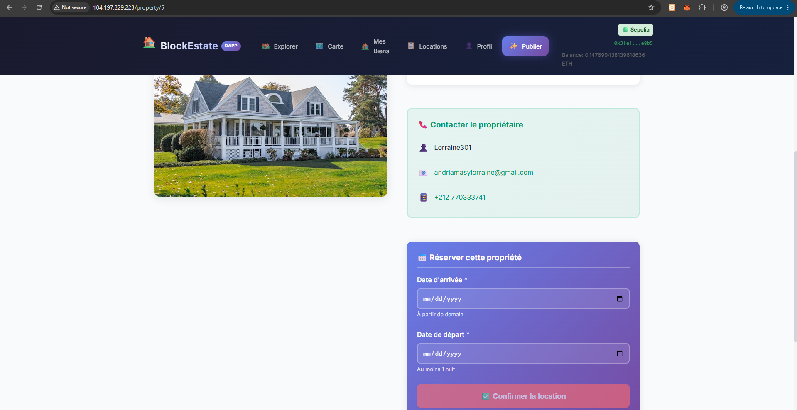
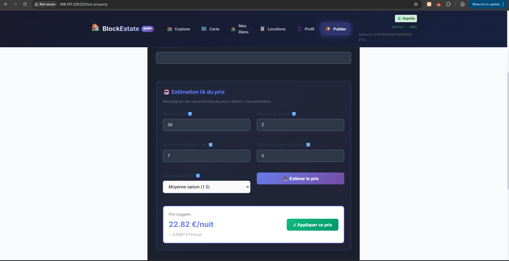
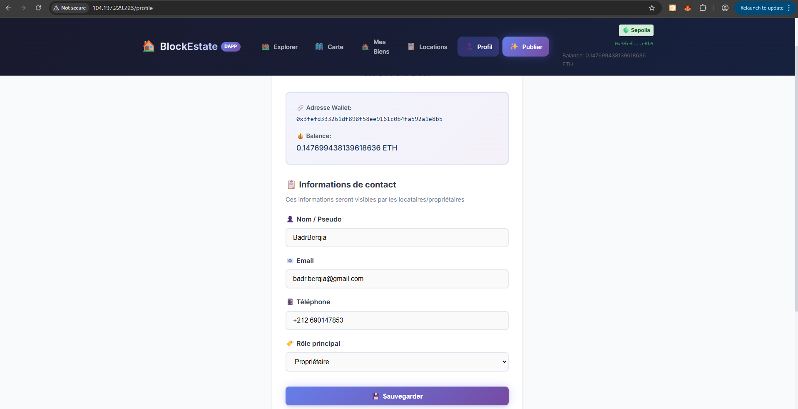
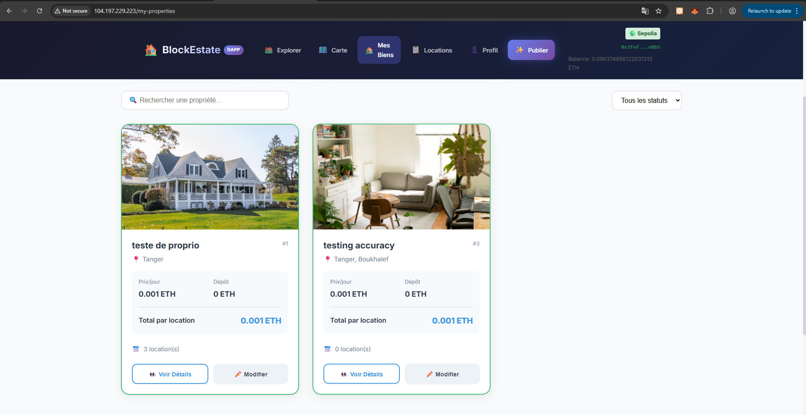
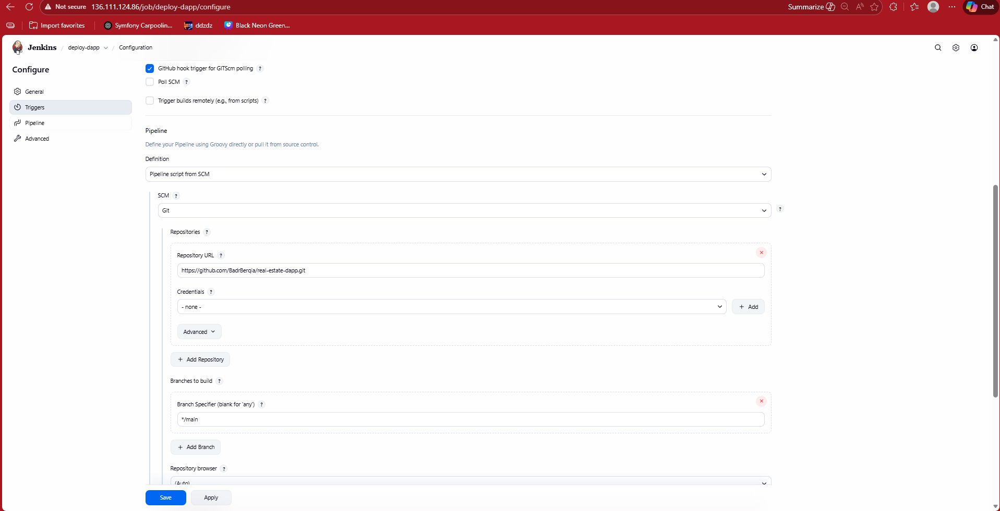
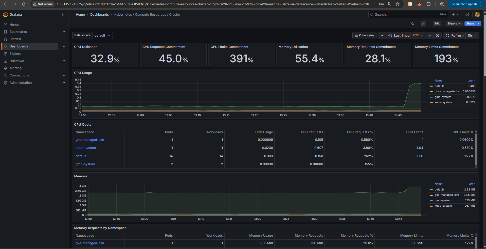

# 🏠 BlockEstate - Location Immobilière Décentralisée

<div align="center">


**Application décentralisée de location immobilière basée sur la blockchain Ethereum**

[Démo Live](http://104.197.229.223) • [Smart Contract](https://sepolia.etherscan.io/address/0x70Fdf00E81a6A3C37E8d557dDca47D70D8dc1B7D)

</div>

---

## 📋 Description

BlockEstate est une plateforme de location immobilière décentralisée qui utilise la technologie blockchain pour sécuriser les transactions entre propriétaires et locataires. L'application intègre également un module d'intelligence artificielle pour l'estimation automatique des prix de location.

### Problématique

Les plateformes de location traditionnelles présentent plusieurs défis :
- Frais d'intermédiaires élevés
- Manque de transparence dans les transactions
- Risques de fraude sur les paiements
- Difficulté à estimer un prix juste

### Solution

BlockEstate résout ces problèmes grâce à :
- **Smart Contracts** : Transactions automatisées et sécurisées
- **Blockchain Ethereum** : Transparence et immutabilité des données
- **IA/ML** : Estimation intelligente des prix de location
- **Architecture Microservices** : Scalabilité et maintenabilité

---

## 🎯 Fonctionnalités

### Pour les Propriétaires
- ✅ Publication de biens immobiliers
- ✅ Estimation IA du prix de location
- ✅ Gestion des réservations
- ✅ Blocage de dates (indisponibilité)
- ✅ Annulation de réservations
- ✅ Tableau de bord des revenus

### Pour les Locataires
- ✅ Recherche et filtrage des propriétés
- ✅ Vue carte interactive (Leaflet)
- ✅ Réservation avec paiement en ETH
- ✅ Historique des locations
- ✅ Contact direct avec le propriétaire

### Fonctionnalités Techniques
- ✅ Authentification MetaMask
- ✅ Profil utilisateur (email, téléphone)
- ✅ Prédiction de prix par ML
- ✅ CI/CD automatisé (Jenkins)
- ✅ Déploiement Kubernetes (GKE)

---

## 🏗️ Architecture

### Architecture Globale
```
┌─────────────────────────────────────────────────────────────────────────┐
│                              UTILISATEUR                                │
│                         (Navigateur + MetaMask)                         │
└─────────────────────────────────┬───────────────────────────────────────┘
                                  │
                    ┌─────────────▼─────────────┐
                    │    Frontend (Angular)     │
                    │    - UI/UX                │
                    │    - Web3.js              │
                    └─────────────┬─────────────┘
                                  │
          ┌───────────────────────┼───────────────────────┐
          │                       │                       │
          ▼                       ▼                       ▼
┌─────────────────┐    ┌─────────────────┐    ┌─────────────────┐
│   Blockchain    │    │  API Gateway    │    │   AI Service    │
│   (Ethereum)    │    │  (Spring Boot)  │    │   (FastAPI)     │
│                 │    │                 │    │                 │
│ - Smart Contract│    │ - Routing       │    │ - Price Model   │
│ - Transactions  │    │ - Load Balance  │    │ - Risk Model    │
│ - Immutabilité  │    │                 │    │ - Recommend     │
└─────────────────┘    └────────┬────────┘    └─────────────────┘
                                │
              ┌─────────────────┼─────────────────┐
              │                 │                 │
              ▼                 ▼                 ▼
    ┌─────────────────┐ ┌─────────────────┐ ┌─────────────────┐
    │  User Service   │ │Property Service │ │Service Discovery│
    │  (Spring Boot)  │ │ (Spring Boot)   │ │    (Eureka)     │
    │                 │ │                 │ │                 │
    │ - Profils       │ │ - Métadonnées   │ │ - Registre      │
    │ - Contacts      │ │ - Photos        │ │ - Health Check  │
    └────────┬────────┘ └────────┬────────┘ └─────────────────┘
             │                   │
             └─────────┬─────────┘
                       ▼
              ┌─────────────────┐
              │   PostgreSQL    │
              │   (Database)    │
              └─────────────────┘
```

### Infrastructure Kubernetes
```
┌──────────────────────────────────────────────────────────────┐
│                    Google Kubernetes Engine                   │
│                                                              │
│  ┌────────────┐ ┌────────────┐ ┌────────────┐ ┌───────────┐ │
│  │  Frontend  │ │ API Gateway│ │ AI Service │ │  Jenkins  │ │
│  │   :80      │ │   :8080    │ │   :8000    │ │   :8080   │ │
│  └────────────┘ └────────────┘ └────────────┘ └───────────┘ │
│                                                              │
│  ┌────────────┐ ┌────────────┐ ┌────────────┐ ┌───────────┐ │
│  │   User     │ │  Property  │ │  Service   │ │ PostgreSQL│ │
│  │  Service   │ │  Service   │ │ Discovery  │ │           │ │
│  │   :8081    │ │   :8082    │ │   :8761    │ │   :5432   │ │
│  └────────────┘ └────────────┘ └────────────┘ └───────────┘ │
│                                                              │
│  ┌─────────────────────────────────────────────────────────┐ │
│  │                    Monitoring Stack                      │ │
│  │         Prometheus + Grafana + AlertManager             │ │
│  └─────────────────────────────────────────────────────────┘ │
└──────────────────────────────────────────────────────────────┘
```

### Pipeline CI/CD
```
┌─────────┐    ┌─────────┐    ┌─────────┐    ┌─────────┐    ┌─────────┐
│  Push   │───▶│ Jenkins │───▶│  Build  │───▶│  Push   │───▶│ Deploy  │
│  Code   │    │ Trigger │    │  Maven  │    │  Image  │    │   K8s   │
│         │    │         │    │  npm    │    │ Kaniko  │    │         │
└─────────┘    └─────────┘    └─────────┘    └─────────┘    └─────────┘
     │                                                            │
     │              GitHub Repository                             │
     └────────────────────────────────────────────────────────────┘
```

---

## 🛠️ Technologies

### Frontend
| Technologie | Version | Usage |
|-------------|---------|-------|
| Angular | 15.x | Framework frontend |
| TypeScript | 5.x | Langage de programmation |
| Web3.js | 4.x | Interaction blockchain |
| Leaflet | 1.9.x | Cartes interactives |
| TailwindCSS | 3.x | Styling |

### Backend
| Technologie | Version | Usage |
|-------------|---------|-------|
| Spring Boot | 3.x | Framework backend |
| Spring Cloud | 2023.x | Microservices |
| Netflix Eureka | - | Service Discovery |
| PostgreSQL | 15 | Base de données |
| FastAPI | 0.109 | API ML/AI |

### Blockchain
| Technologie | Version | Usage |
|-------------|---------|-------|
| Solidity | 0.8.x | Smart Contracts |
| Ethereum | Sepolia | Réseau de test |
| MetaMask | - | Wallet |
| Ethers.js | 6.x | Librairie Web3 |

### DevOps
| Technologie | Version | Usage |
|-------------|---------|-------|
| Kubernetes | 1.28 | Orchestration |
| Google GKE | - | Cloud Provider |
| Jenkins | 2.x | CI/CD |
| Kaniko | - | Build d'images |
| Docker | 24.x | Conteneurisation |
| Prometheus | - | Monitoring |
| Grafana | - | Dashboards |

### Intelligence Artificielle
| Technologie | Version | Usage |
|-------------|---------|-------|
| Python | 3.10 | Langage |
| Scikit-learn | 1.7.2 | Modèles ML |
| Pandas | 2.2.3 | Data processing |
| NumPy | 2.2.6 | Calculs numériques |

---

## 📦 Structure du Projet
```
real-estate-dapp/
├── 📁 backend/
│   ├── 📁 api-gateway/          # Point d'entrée API
│   ├── 📁 service-discovery/    # Eureka Server
│   ├── 📁 user-service/         # Gestion utilisateurs
│   ├── 📁 property-service/     # Gestion propriétés
│   └── 📁 ai-service/           # Service ML (FastAPI)
│       ├── 📁 app/
│       │   ├── main.py          # API endpoints
│       │   └── 📁 models/       # Modèles ML (.pkl)
│       ├── Dockerfile
│       └── requirements.txt
│
├── 📁 frontend/
│   ├── 📁 src/
│   │   ├── 📁 app/
│   │   │   ├── 📁 components/   # Composants Angular
│   │   │   ├── 📁 services/     # Services (Web3, API)
│   │   │   └── 📁 models/       # Interfaces TypeScript
│   │   └── 📁 assets/
│   ├── angular.json
│   └── package.json
│
├── 📁 contracts/
│   └── RentalPlatform.sol       # Smart Contract
│
├── 📁 k8s/
│   ├── 📁 backend/              # Manifests microservices
│   ├── ai-service.yaml
│   └── frontend.yaml
│
├── Jenkinsfile                   # Pipeline CI/CD
└── README.md
```

---

## 🚀 Installation & Déploiement

### Prérequis

- Node.js 18+
- Java 17+
- Python 3.10+
- Docker
- kubectl
- gcloud CLI
- MetaMask (extension navigateur)

### Installation Locale

#### 1. Cloner le repository
```bash
git clone https://github.com/BadrBerqia/real-estate-dapp.git
cd real-estate-dapp
```

#### 2. Backend (Spring Boot)
```bash
cd backend/service-discovery
mvn clean package -DskipTests
java -jar target/*.jar

# Répéter pour api-gateway, user-service, property-service
```

#### 3. AI Service (FastAPI)
```bash
cd backend/ai-service
pip install -r requirements.txt
uvicorn app.main:app --host 0.0.0.0 --port 8000
```

#### 4. Frontend (Angular)
```bash
cd frontend
npm install
ng serve
```

#### 5. Smart Contract

Le contrat est déjà déployé sur Sepolia :
- **Adresse** : `0x70Fdf00E81a6A3C37E8d557dDca47D70D8dc1B7D`
- **Etherscan** : [Voir sur Sepolia](https://sepolia.etherscan.io/address/0x70Fdf00E81a6A3C37E8d557dDca47D70D8dc1B7D)

### Déploiement Kubernetes (GKE)

#### 1. Créer le cluster
```bash
gcloud container clusters create real-estate-cluster \
  --zone us-central1-a \
  --num-nodes 1 \
  --machine-type e2-medium
```

#### 2. Déployer les services
```bash
kubectl apply -f k8s/backend/
kubectl apply -f k8s/ai-service.yaml
kubectl apply -f k8s/frontend.yaml
```

#### 3. Vérifier le déploiement
```bash
kubectl get pods
kubectl get services
```

---

## 🤖 Module IA/ML

### Modèles Disponibles

| Modèle | Endpoint | Description |
|--------|----------|-------------|
| **Price Prediction** | `POST /predict/price` | Estime le prix de location optimal |
| **Risk Assessment** | `POST /predict/risk` | Évalue le risque d'un locataire |
| **Recommendation** | `POST /recommend` | Recommande une catégorie de bien |

### Exemple d'utilisation
```bash
# Prédiction de prix
curl -X POST http://35.192.0.248:30800/predict/price \
  -H "Content-Type: application/json" \
  -d '{
    "surface": 75,
    "rooms": 3,
    "location_score": 8.0,
    "distance_center": 5.0,
    "season_index": 1.0
  }'

# Réponse
{
  "suggested_price": 970.95,
  "currency": "EUR",
  "input": {...}
}
```

### Features utilisées

| Feature | Description | Range |
|---------|-------------|-------|
| `surface` | Surface en m² | 10 - 500 |
| `rooms` | Nombre de pièces | 1 - 20 |
| `location_score` | Qualité du quartier | 1 - 10 |
| `distance_center` | Distance centre-ville (km) | 0 - 50 |
| `season_index` | Coefficient saisonnier | 0.8 - 1.2 |

---

## 📸 Screenshots

### Page d'Accueil

*Hero section avec statistiques et accès rapide*

### Liste des Propriétés

*Recherche et filtrage des biens disponibles*

### Vue Carte

*Visualisation géographique avec prix affichés*

### Détail Propriété


*Informations complètes et formulaire de réservation*

### Estimation IA

*Prédiction intelligente du prix de location*

### Page Profil

*Gestion des informations de contact*

### Mes Propriétés (Owner)

*Tableau de bord propriétaire avec réservations*

### Pipeline Jenkins

*CI/CD automatisé*

### Monitoring Grafana

*Dashboards de monitoring*

---

## 📊 Smart Contract

### Fonctions Principales
```solidity
// Publication d'une propriété
function listProperty(
    string memory _title,
    string memory _description,
    string memory _location,
    uint256 _pricePerDay,
    uint256 _deposit
) external

// Location d'une propriété
function rentProperty(
    uint256 _propertyId,
    uint256 _startDate,
    uint256 _endDate
) external payable

// Annulation (propriétaire)
function cancelRental(uint256 _rentalId) external

// Fin de location + remboursement dépôt
function completeRental(uint256 _rentalId) external
```

### Events
```solidity
event PropertyListed(uint256 indexed propertyId, address indexed owner);
event PropertyRented(uint256 indexed propertyId, address indexed tenant);
event RentalCancelled(uint256 indexed rentalId);
event RentalCompleted(uint256 indexed rentalId);
```

---

## 🔒 Sécurité

- ✅ Authentification via MetaMask (clé privée jamais exposée)
- ✅ Smart Contract audité
- ✅ Transactions signées côté client
- ✅ CORS configuré sur les APIs
- ✅ Variables sensibles en secrets Kubernetes

---

## 👥 Équipe

| Membre | Rôle |
|--------|------|
| **Badr BERQIA** | Cloud/DevOps Lead |
| **Badr BERQIA** | Frontend/Backend/Blockchain |
| **Issahou** | Frontend/Blockchain |
| **Ouallali** | Backend |
| **Lorraine** | AI/ML |

---

## 📚 Références

- [Solidity Documentation](https://docs.soliditylang.org/)
- [Angular Documentation](https://angular.io/docs)
- [Spring Boot Documentation](https://spring.io/projects/spring-boot)
- [Kubernetes Documentation](https://kubernetes.io/docs/)
- [Scikit-learn Documentation](https://scikit-learn.org/)

---

## 📄 Licence

Ce projet est réalisé dans le cadre académique.

**Projet JEE/ML** - Cycle Ingénieur LSI  
**Professeur** : Pr. L. EL AACHAK  
**Année Universitaire** : 2025-2026  
**Établissement** : FST Tanger

---

<div align="center">

🏠 **BlockEstate** - La location immobilière réinventée

</div>